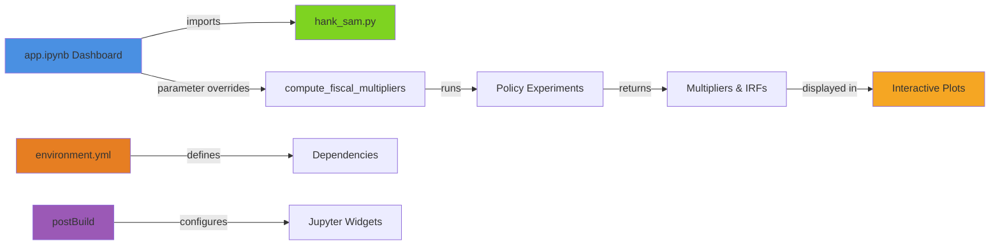

# HANK-SAM Model Interactive Dashboard

This interactive dashboard allows you to explore the HANK-SAM model's fiscal multipliers under different monetary and fiscal policy parameters.

## Features

- **Real-time parameter adjustment**: Modify model parameters and see results update automatically
- **Multiple policy regimes**: Compare standard Taylor rule, fixed nominal rate, and fixed real rate monetary policies
- **Three fiscal policies**: Analyze UI extensions, stimulus checks (transfers), and tax cuts
- **Visual outputs**: 
  - Fiscal multipliers over 20 quarters
  - Consumption impulse responses
  - Parameter summary display
- **🚀 Auto-deployment**: GitHub Actions with MyBinder integration for seamless sharing

## Files Overview

- **`app.ipynb`**: Main Jupyter notebook dashboard (primary file for Voila)
- **`app.py`**: Python script version (jupytext sync with notebook)
- **`hank_sam.py`**: Core HANK-SAM model implementation
- **`environment.yml`**: Canonical conda environment with all dependencies
- **`postBuild`**: MyBinder setup script for widget configuration

## Requirements

- **Python**: 3.11+ (specified in environment.yml)
- **Environment**: All dependencies managed via `environment.yml`
- **Jupyter widgets**: Pre-configured for Voila compatibility

## Installation & Setup

### Method 1: Using Conda/Micromamba (Recommended)

```bash
# Create environment from dashboard directory
conda env create -f environment.yml
conda activate hafiscal-dashboard

# Enable Jupyter widgets
jupyter nbextension enable --py widgetsnbextension --sys-prefix
```

### Method 2: Using Existing Environment

If you have the main project environment:

```bash
# Activate your existing environment
conda activate hafiscal  # or your environment name

# Install additional dashboard dependencies
pip install voila ipywidgets nbconvert
jupyter nbextension enable --py widgetsnbextension --sys-prefix
```

## Running the Dashboard

### Method 1: Voila (Recommended for Production)

```bash
# Run from project root directory (important!)
voila dashboard/app.ipynb --no-browser
```

Then open your browser to the URL shown (typically http://localhost:8866).

### Method 2: Jupyter Notebook (Development)

```bash
# Run from project root directory
jupyter notebook dashboard/app.ipynb
```

Run all cells to see the interactive dashboard in notebook mode.

### Method 3: MyBinder (Public Repos) / Codespaces (All Repos)

**For Public Repositories:**
[](https://mybinder.org/v2/gh/econ-ark/HAFiscal/master?urlpath=voila%2Frender%2Fapp.ipynb)

**[🔬 Launch Dashboard on MyBinder](https://mybinder.org/v2/gh/econ-ark/HAFiscal/master?urlpath=voila%2Frender%2Fapp.ipynb)** - Zero setup required!

**For All Repositories (GitHub Codespaces):**
1. **Launch Codespaces**: Click "Code" → "Codespaces" → "Create codespace" 
2. **Wait for setup**: Environment auto-configures (2-3 minutes)
3. **Run dashboard**: Execute `dashboard/start-dashboard.sh` in terminal
4. **Access dashboard**: Click forwarded port 8866 in Ports tab

*Note: MyBinder works for public repos immediately. Codespaces requires GitHub Pro/Team for private repos.*

### Codespaces Setup

Create `.devcontainer/devcontainer.json` with this configuration:

<details>
<summary>Click to expand devcontainer.json</summary>

```json
{
  "name": "HANK-SAM Dashboard Environment",
  "image": "mcr.microsoft.com/devcontainers/miniconda:3",
  "onCreateCommand": "conda env create -f dashboard/environment.yml",
  "forwardPorts": [8866],
  "portsAttributes": {
    "8866": {
      "label": "Voila Dashboard",
      "onAutoForward": "notify"
    }
  },
  "customizations": {
    "vscode": {
      "extensions": ["ms-python.python", "ms-toolsai.jupyter"]
    }
  }
}
```
</details>

## Deployment

### GitHub Actions Integration

**Intelligent Hybrid Deployment:**

✅ **Auto-Detection**: Automatically detects public vs private repositories  
✅ **Public Repos**: MyBinder + GitHub Pages + downloadable packages  
✅ **Private Repos**: Codespaces + downloadable packages  
✅ **Comprehensive Testing**: All dashboard functionality verified automatically  
✅ **Smart PR Comments**: Repository-specific deployment instructions  
✅ **Multi-Platform**: Universal support for all deployment methods  

**Deployment Matrix:**

| Repository Type | Live Dashboard | Download Package | Cloud Development |
|----------------|----------------|------------------|-------------------|
| **Public** | ✅ GitHub Pages + MyBinder | ✅ Instant download | ✅ Codespaces |
| **Private** | ❌ (not accessible) | ✅ Instant download | ✅ Codespaces |

**Triggered by:**
- Push to main/master/dashboard branches
- Pull requests with dashboard changes
- Manual workflow dispatch

### Complete File Structure

```
HAFiscal-Latest/
├── .devcontainer/
│   └── devcontainer.json           # GitHub Codespaces configuration
├── .github/workflows/
│   └── deploy-dashboard.yml        # Automated testing & packaging
└── dashboard/
    ├── app.ipynb                   # Main dashboard notebook
    ├── app.py                      # Python script version (synced)
    ├── hank_sam.py                 # Core HANK-SAM model
    ├── hafiscal.py                 # Additional model components
    ├── environment.yml             # Complete environment specification
    ├── postBuild                   # Jupyter widget setup script
    ├── start-dashboard.sh          # One-click launcher
    ├── test_app.py                 # Dashboard functionality tests
    ├── test_hank_sam.py            # Model validation tests
    └── DASHBOARD_README.md         # This documentation
```

**Generated Artifacts:**
- `setup-dashboard.sh` - Universal setup script (conda/micromamba)
- `README.md` - Complete package documentation
- `BUILD_INFO.txt` - Version and build metadata

## Tunable Parameters

### Monetary Policy
- **Taylor Rule π coefficient (φπ)**: Central bank's response to inflation (1.0-3.0)
- **Taylor Rule Y coefficient (φy)**: Central bank's response to output gap (0.0-1.0)
- **Taylor Rule inertia (ρr)**: Interest rate smoothing parameter (0.0-0.95)
- **Phillips curve slope (κp)**: Price flexibility parameter (0.01-0.2)

### Fiscal & Structural
- **Fiscal adjustment speed (φb)**: How quickly taxes adjust to debt (0.0-0.1)
- **Real wage rigidity**: Degree of wage stickiness (0.0-1.0)

### Policy Durations
- **UI extension length**: Duration of unemployment insurance extension (1-12 quarters)
- **Stimulus check length**: Duration of transfer payments (1-4 quarters)
- **Tax cut length**: Duration of tax reduction (1-16 quarters)

## Understanding the Output

### Fiscal Multipliers Plot
Shows the cumulative fiscal multiplier (output per dollar of fiscal spending) over time for each policy under different monetary regimes:
- **Solid lines**: Standard Taylor rule
- **Dashed lines**: Fixed nominal interest rate
- **Dotted lines**: Fixed real interest rate

### Consumption Response Plot
Shows percentage deviation of consumption from steady state in response to each fiscal policy.

### Key Insights
- **UI extensions** typically have the highest multipliers due to targeting liquidity-constrained households
- **Fixed nominal/real rates** amplify fiscal policy effects compared to active Taylor rule
- **Tax cuts** generally have lower multipliers due to savings leakage among higher-income households

## Performance Notes

- **Simulation time**: 15-30 seconds per run (normal for HANK models)
- **Memory usage**: ~2-4GB RAM recommended for smooth operation
- **Browser compatibility**: Works best in Chrome/Firefox with JavaScript enabled

## Architecture



## Development Workflow

### Fully Automated Pipeline

1. **Edit & Push**: Make changes to dashboard files, push to GitHub
2. **Automatic Testing**: GitHub Actions runs comprehensive test suite
3. **Package Creation**: Complete dashboard bundle generated automatically  
4. **PR Integration**: Auto-generated comments with testing instructions
5. **Ready to Deploy**: Multiple deployment options available instantly

### Manual Development

1. **Local editing**: Edit `app.ipynb` or `app.py` (automatically synced)
2. **Local testing**: Run via Voila or Jupyter notebook
3. **Environment updates**: Modify `environment.yml` (single source of truth)
4. **Push & Go**: Commit → Push → GitHub Actions handles the rest

### What Happens Automatically

✅ **Repository Detection**: Automatically identifies public vs private repo  
✅ **Environment Testing**: Verify all dependencies install correctly  
✅ **Import Validation**: Test all dashboard modules load properly  
✅ **Functionality Testing**: Run complete test suite  
✅ **Adaptive Deployment**: 
  - **Public repos**: Live GitHub Pages + MyBinder integration
  - **Private repos**: Codespaces setup + package downloads
✅ **Smart PR Comments**: Repository-specific instructions  
✅ **Universal Packages**: Self-contained bundles for all environments  
✅ **Professional Landing Pages**: Beautiful HTML interfaces (public repos)  

**Zero manual configuration required!** The workflow adapts automatically.

## Troubleshooting

### Common Issues

1. **Import errors**: 
   - Ensure you're in the `dashboard/` directory
   - Check that environment is properly activated
   - Verify `hank_sam.py` is in the same directory

2. **Slow simulation updates**: 
   - Normal behavior - HANK models are computationally intensive
   - Consider closing other applications to free up memory

3. **Widget display issues**:
   - Run: `jupyter nbextension enable --py widgetsnbextension --sys-prefix`
   - Restart Jupyter/Voila after enabling extensions

4. **MyBinder timeouts**:
   - First launch takes 2-3 minutes to build environment
   - Subsequent launches from same GitHub commit are faster

### Environment Issues

If dependencies are missing or outdated:

```bash
# Recreate environment from scratch
conda env remove -n hafiscal-dashboard
conda env create -f environment.yml
conda activate hafiscal-dashboard
```

## Testing

Run the test suite to verify dashboard functionality:

```bash
# Run tests from project root directory
pytest dashboard/test_app.py dashboard/test_hank_sam.py -v
```

## Citation

If you use this dashboard in your research, please cite the original HAFiscal paper and acknowledge the dashboard implementation.

---

**Authors**: Alan Lujan <alujan@jhu.edu>  
**License**: Same as main HAFiscal project  
**Last Updated**: July 2025 